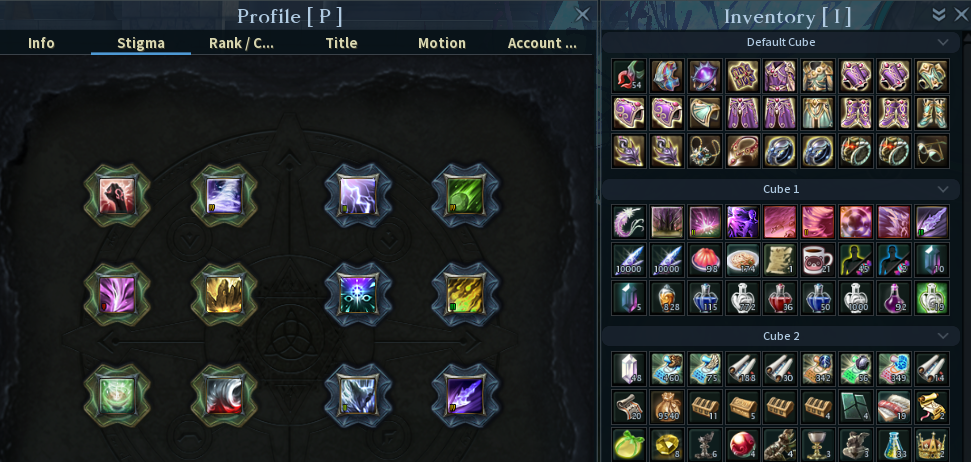

# Installation
Download the Zip https://github.com/datgame-aion/stigma_patcher/archive/refs/heads/main.zip extract it somewhere.
The script uses https://github.com/astral-sh/uv to manage the python Installation and dependencies, a somewhat recent version at the timne of writing is included for convenience, and thus it should run without any Installation

# Function

A script to apply and optionally undo the Stigma patch to aion classic eu (and potentionally other classic servers if
given their path with --base-path argument)

Additional options are are: 

```
  --ui                  Simplifies the style of the UI
  --no-cloud            Removes clouds on Eos map
  --lucky               makes you lucky
  --ui-big              Makes all target bars in the ui the same size
  --no-stigma           Does not patch stigma

  --agent               Applies the Agent GS extend skin onto lannok
  --white               Makes cavalier plate armor white
  --rospet              Adds (new) changes rospet wants

  --wings               Applies the Phaistos wings onto Romantic wings
  --cammi               Adds (new) changes cammi wants
  --madnez              Adds changes madnez wants


  --no-cleanup          Does remove the extracted e.g. to see what went wrong
```


you can undo all patches by running with --undo
run_all.bat and undo.bat are provided feel free to edit them to change what patches are applied

